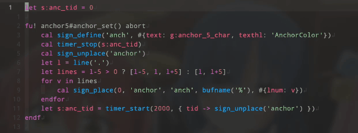

# vim-anchor5


`<Tab>` `<S-Tab>` to jump 5row & put sign `Anchor` on currentrow, +5row, -5row.

Automatically disappear after 2000 [ms] by default.

# Installation

For example, with [vim-plug](https://github.com/junegunn/vim-plug):
```vim
Plug 'serna37/vim-anchor5'
```
and `:PlugInstall`

# Usage
## default keymap
```vim
nnoremap <Tab> 5j<Plug>(anchor)
nnoremap <S-Tab> 5k<Plug>(anchor)
nnoremap H H<Plug>(anchor)
nnoremap M M<Plug>(anchor)
nnoremap L L<Plug>(anchor)
```

## disable default keymap
```vim
" in your .vimrc
let g:anchor_5_default_map = 0
```

## custom
### sign char
```vim
" change sign char
let g:anchor_5_char = '➤'
```

### sign color
```vim
" change sign color
hi AnchorColor ctermfg=204
" and create auto_group for changing colorscheme
aug anchor_color
    au!
    au ColorScheme * hi AnchorColor ctermfg=204
aug END
hi AnchorColor ctermfg=204
```

# LICENSE
[MIT](./LICENSE)
